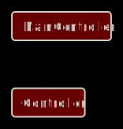

# Calc

## Description
A simple REST API calculator. It includes the main functions: addition, subtraction, multiplication, division. Works
with integers and decimals.

## Used tools
* Platform: Spring Boot 2.6.3
* Builder: Gradle
* Languages: Java 8 (JDK 8)
* Dependencies: Spring Web

## Important files
* Builder configuration: /build.gradle
* Application properties: /src/main/resources/application.properties

## Backend schema

## Installation
1. Run this project in a development environment
2. Open for example http://localhost:8080/?op=add&num=1&num2=0.0015 in the browser

## Release notes
* Project type: REST API
* Date of release: 13 February 2022
* Date of last update: 30 May 2022
* Current version: 1.9
